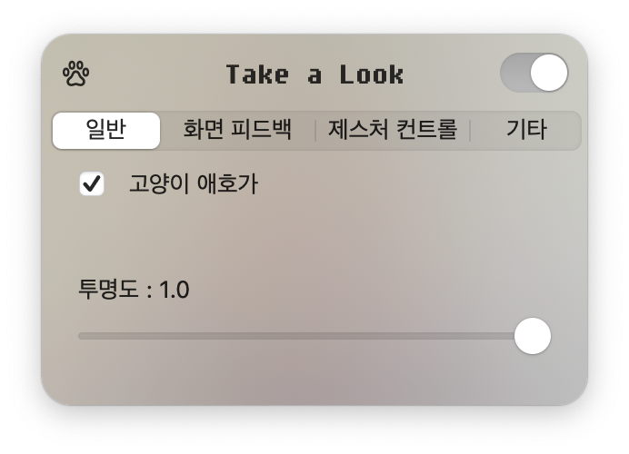
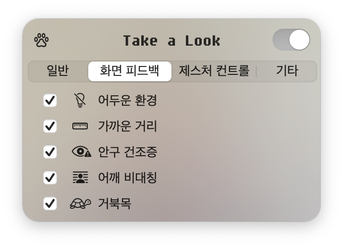
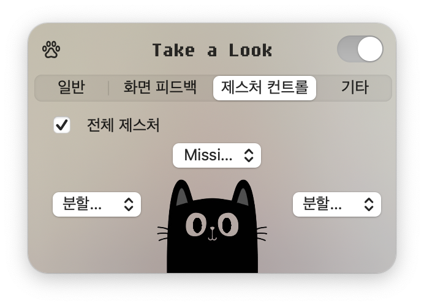
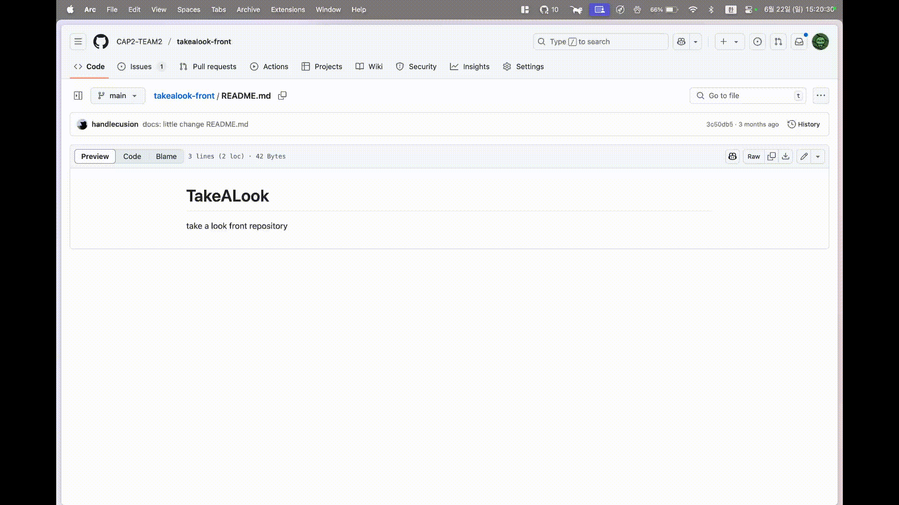

# takealook-front

takealook의 프론트엔드 실행 환경 및 정보 제공

## On Running

### Tab1 : General

turn ON/OFF the cat image

control opacity to see current posture

### Tab2 : Feedbacks

turn ON/OFF each feedbacks

### Tab3 : Gestures

manage gesture commands

#### Tab4 : Others

visible socket-communication value

## Feedbacks
all feedback fixes screen until posture gets to normal

### no face

hide screen when no face detected

### too close
screen zooms to center

### asymmetric face & shoulder
screen collapses diagonally

### less blinking
screen gets blured

### forward head posture
screen falls down

